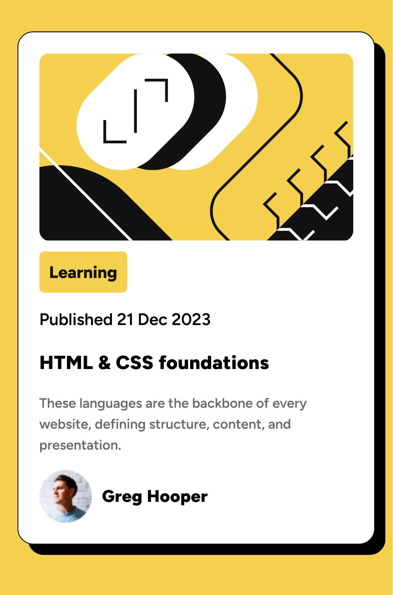

# Frontend Mentor - Blog Preview Card Solution

This is a solution to the [Blog Preview Card challenge on Frontend Mentor](https://www.frontendmentor.io/challenges/blog-preview-card-ckPaj01IcS). Frontend Mentor challenges help you improve your coding skills by building realistic projects.

## Table of Contents

- [Overview](#overview)
  - [The Challenge](#the-challenge)
  - [Screenshot](#screenshot)
  - [Links](#links)
- [My Process](#my-process)
  - [Built With](#built-with)
  - [What I Learned](#what-i-learned)
  - [Continued Development](#continued-development)
  - [Useful Resources](#useful-resources)
- [Author](#author)
- [Acknowledgments](#acknowledgments)

## Overview

### The Challenge

Users should be able to:

- See hover and focus states for all interactive elements on the page.

### Screenshot

### Links

- Solution URL: [GitHub Repository](https://github.com/Z3ra33/Frontend-Mentor-Challenges/tree/main/blog-preview-card-main)
- Live Site URL: [Live Demo](https://frontend-mentor-challenges-x3b3.vercel.app/)

## My Process

### Built With

- Semantic HTML5 markup
- CSS custom properties
- Flexbox

### What I Learned

This challenge was a great opportunity for me to learn about box shadows and max-width properties. I also practiced concepts from previous lessons.

### Continued Development

I plan to explore more advanced CSS techniques and improve my understanding of responsive design.

### Useful Resources

- [CSS Tricks](https://css-tricks.com/)
- [MDN Web Docs](https://developer.mozilla.org/)

## Author

- Frontend Mentor - [@Z3ra33](https://www.frontendmentor.io/profile/Z3ra33)

## Acknowledgments

Thanks to Frontend Mentor for providing such engaging challenges that help improve my skills.
