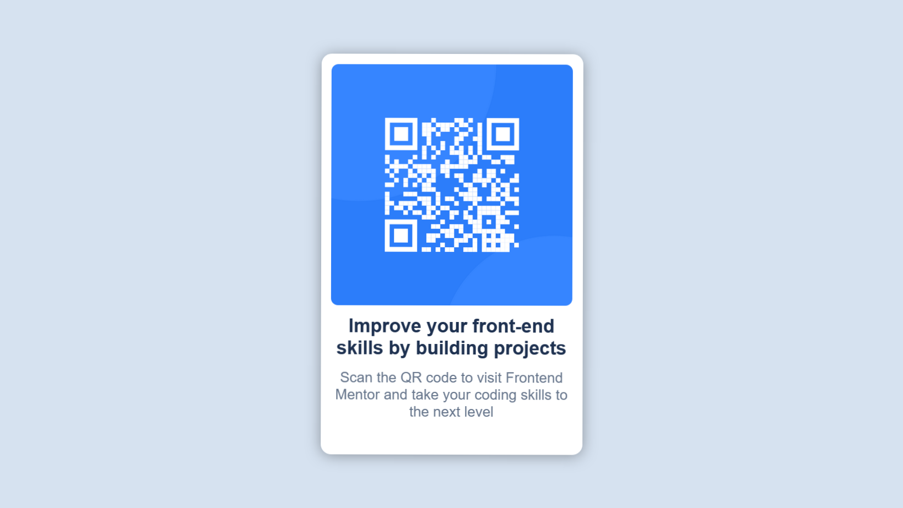

# Frontend Mentor - QR Code Component Solution

This is a solution to the [QR code component challenge on Frontend Mentor](https://www.frontendmentor.io/challenges/qr-code-component-iux_sIO_H). Frontend Mentor challenges help you improve your coding skills by building realistic projects.

## Table of Contents

- [Overview](#overview)
  - [Screenshot](#screenshot)
  - [Links](#links)
- [My Process](#my-process)
  - [Built With](#built-with)
- [Author](#author)

## Overview

### Screenshot

### Links

- Solution URL: [GitHub Repository](https://github.com/Z3ra33/Frontend-Mentor-Challenges/tree/main/qr-code-component-main)
- Live Site URL: [Live Demo](https://frontend-mentor-challenges-qr-code.vercel.app/)

## My Process

### Built With

- Semantic HTML5 markup
- CSS custom properties
- Flexbox

## Author

- Frontend Mentor - [@Z3ra33](https://www.frontendmentor.io/profile/Z3ra33/)
