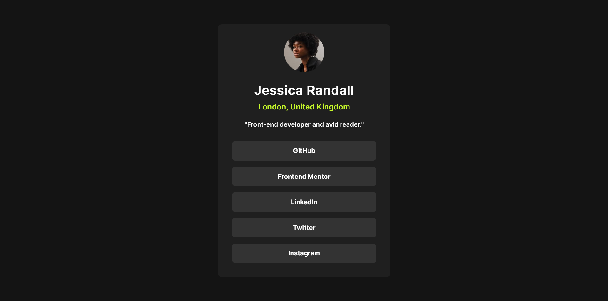
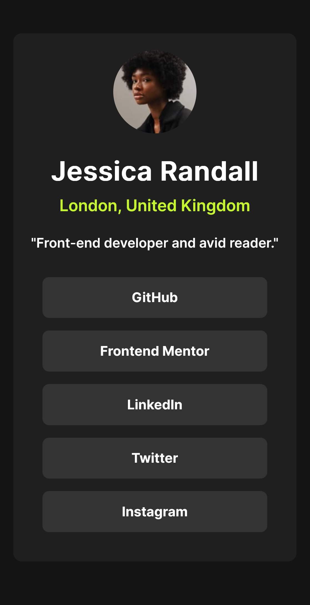

# Frontend Mentor - Social Links Profile Solution

This is a solution to the [Social Links Profile challenge on Frontend Mentor](https://www.frontendmentor.io/challenges/social-links-profile-UG32l9m6dQ). Frontend Mentor challenges help you improve your coding skills by building realistic projects.

## Table of Contents

- [Overview](#overview)
  - [The Challenge](#the-challenge)
  - [Screenshot](#screenshot)
  - [Links](#links)
- [My Process](#my-process)
  - [Built With](#built-with)
  - [What I Learned](#what-i-learned)
  - [Continued Development](#continued-development)
  - [Useful Resources](#useful-resources)
- [Author](#author)
- [Acknowledgments](#acknowledgments)

## Overview

### The Challenge

Users should be able to:

- See hover and focus states for all interactive elements on the page.

### Screenshot

### Links

- Solution URL: [View Solution](https://github.com/Z3ra33/Frontend-Mentor-Challenges/tree/main/social-links-profile-main)
- Live Site URL: [View Live Site](https://frontend-mentor-challenges-git-477cad-zahras-projects-e2277303.vercel.app)

## My Process

### Built With

- Semantic HTML5 markup
- CSS custom properties
- Flexbox

## Author

- Frontend Mentor - [@Z3ra33](https://www.frontendmentor.io/profile/Z3ra33)
